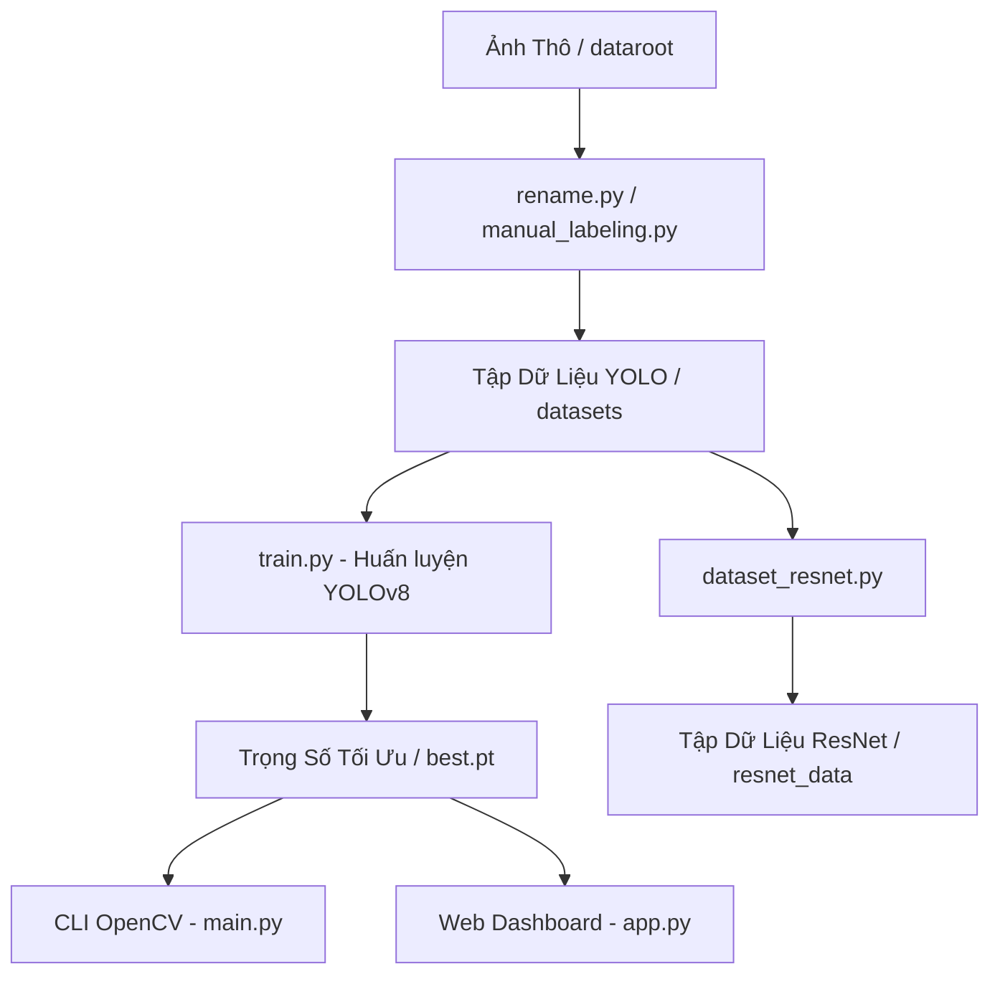

# Hệ Thống Nhận Diện Người Lớn & Trẻ Em (AI Ticket Counter)

Hệ thống **Adult & Child Detection** là một giải pháp thị giác máy tính thời gian thực được thiết kế để phát hiện và phân loại con người thành hai nhóm tuổi: **Người lớn (Adult)** và **Trẻ em (Child)**. Lõi nhận diện của hệ thống sử dụng mô hình YOLOv8 được tinh chỉnh (fine-tuned) từ trọng số pre-trained `yolo26s.pt` trên tập dữ liệu tùy chỉnh.

Kho lưu trữ cung cấp hai giao diện sử dụng chính:
1. **AI Ticket Counter Enterprise (Streamlit Web App)**: Một bảng điều khiển (dashboard) giàu tính năng hỗ trợ theo dõi người đi qua vạch ảo kiểm soát (line crossing), ước tính chiều cao vật lý bằng thuật toán hồi quy phối cảnh, tính toán doanh thu bán vé ước tính (dựa trên giá vé Người lớn và Trẻ em) và hiển thị thống kê lượng khách thời gian thực.
2. **CLI Runner (OpenCV CLI)**: Script chạy trên dòng lệnh để kiểm thử nhanh mô hình trên ảnh tĩnh, video hoặc live webcam.

Dự án cũng đi kèm các công cụ phụ trợ hữu ích để dán nhãn dữ liệu bán tự động, chuyển đổi tập dữ liệu sang định dạng phân loại hình ảnh (ví dụ: ResNet) và đổi tên loạt tệp tin ảnh thô.


---

## Tổng Quan
Dự án cung cấp một quy trình hoàn chỉnh từ khâu chuẩn bị dữ liệu, huấn luyện mô hình phát hiện đối tượng YOLOv8 phân loại người lớn/trẻ em, cho đến triển khai ứng dụng trên cả giao diện đồ họa tương tác trực quan lẫn giao diện dòng lệnh. Hệ thống hướng đến việc ứng dụng tại các cổng kiểm soát vé, thống kê nhân khẩu học và tự động hóa tính phí ra vào cửa.

---

## Tính Năng
- **Nhận Diện & Phân Loại Thời Gian Thực**: Nhận diện người lớn (`Adult` - hộp bao màu xanh lá) và trẻ em (`Child` - hộp bao màu đỏ) bằng mô hình YOLOv8 đã được tinh chỉnh.
- **Theo Dõi Qua Vạch Ảo (Line Crossing Tracker)**: Cấu hình linh hoạt vạch kiểm soát ảo trên màn hình để theo dõi hướng di chuyển, đếm lượt vào (`IN`) và lượt ra (`OUT`). Hỗ trợ 4 hướng di chuyển cắt vạch:
  - Từ Trên xuống Dưới
  - Từ Dưới lên Trên
  - Từ Trái sang Phải
  - Từ Phải sang Trái
- **Ước Tính Chiều Cao**: Sử dụng mô hình hồi quy tuyến tính dựa trên chiều cao hộp bao (bounding box height) và tọa độ vị trí chân phối cảnh để ước lượng chiều cao vật lý của đối tượng (đơn vị: cm).
- **Tính Toán Doanh Thu**: Tự động tính toán doanh thu dựa trên số lượt người đi vào cổng (Mặc định: 100.000 VNĐ đối với Người lớn, 50.000 VNĐ đối với Trẻ em).
- **Hỗ Trợ Đa Nguồn Đầu Vào**:
  - Hình ảnh tĩnh (JPEG, PNG, BMP, AVIF).
  - Tệp tin video (MP4, AVI, MOV).
  - Webcam của máy tính.
  - IP Camera (ví dụ: truyền luồng HTTP/RTSP từ webcam điện thoại).
- **Dán Nhãn Bán Tự Động**: Script tiện ích (`utils/manual_labeling.py`) tự động dùng YOLO để phát hiện người, cắt ảnh vùng đối tượng (crop) và nhắc người dùng nhấn phím nhanh (`0` cho Adult, `1` cho Child) để tạo tệp nhãn định dạng YOLO một cách nhanh chóng.
- **Chuẩn Bị Dữ Liệu Cho Mô Hình Phân Loại**: Script tiện ích (`utils/dataset_resnet.py`) tự động cắt các đối tượng từ tập dữ liệu YOLO và lưu vào các thư mục phân lớp riêng biệt (`adult`/`child`) để phục vụ huấn luyện các bộ phân loại ảnh như ResNet.

---

## Công Nghệ Sử Dụng
- **AI & Deep Learning**: Ultralytics YOLOv8, PyTorch (hỗ trợ tăng tốc GPU qua CUDA).
- **Giao Diện Web**: Streamlit.
- **Xử Lý Hình Ảnh**: OpenCV (cv2).
- **Phân Tích Dữ Liệu**: NumPy, Pandas, Scikit-learn, Joblib.

---

## Kiến Trúc Hệ Thống
Quy trình xử lý dữ liệu và vận hành của hệ thống được tóm tắt qua sơ đồ dưới đây:



---

## Cấu Trúc Dự Án
```text
detect_adult-child/
├── datasets/                 # Thư mục tập dữ liệu YOLO
│   ├── train/                # Hình ảnh và nhãn dùng để huấn luyện
│   ├── val/                  # Hình ảnh và nhãn dùng để xác thực
│   └── test/                 # Hình ảnh và nhãn dùng để kiểm thử
├── runs/                     # Kết quả đầu ra của quá trình huấn luyện YOLOv8
│   └── detect/runs/train/... # Thư mục chứa trọng số tốt nhất (best.pt)
├── utils/                    # Các script tiện ích quản lý tập dữ liệu
│   ├── rename.py             # Đổi tên hàng loạt ảnh thô trong dataroot
│   ├── manual_labeling.py    # Công cụ dán nhãn bán tự động tương tác trực quan
│   └── dataset_resnet.py     # Cắt ảnh đối tượng để tạo tập dữ liệu phân loại ResNet
├── test_case/                # Các video và ảnh mẫu dùng để kiểm thử nhanh
├── app.py                    # Ứng dụng web dashboard Streamlit
├── main.py                   # Script dòng lệnh chạy suy diễn qua OpenCV
├── train.py                  # Script cấu hình huấn luyện mô hình
├── data.yaml                 # File cấu hình tập dữ liệu YOLO
├── requirements.txt          # Danh sách thư viện Python phụ thuộc
├── yolo26s.pt                # Trọng số mô hình cơ bản (pre-trained)
└── README.md                 # Tài liệu hướng dẫn sử dụng dự án
```

---

## Yêu Cầu Hệ Thống
- **Hệ Điều Hành**: Windows, Linux, hoặc macOS.
- **Python**: Phiên bản 3.9 trở lên.
- **Phần Cứng**: GPU NVIDIA (khuyến nghị RTX 2050 4GB trở lên) và cài đặt sẵn CUDA Toolkit tương thích để tăng tốc xử lý và đạt tốc độ thời gian thực.

---

## Cài Đặt
1. Tải mã nguồn dự án về máy:
   ```bash
   git clone https://github.com/345bc/detect_adult-child.git
   cd detect_adult-child
   ```

2. Tạo và kích hoạt môi trường ảo:
   ```bash
   python -m venv venv
   # Trên Windows:
   venv\Scripts\activate
   # Trên Linux/macOS:
   source venv/bin/activate
   ```

3. Cài đặt các thư viện phụ thuộc:
   ```bash
   pip install -r requirements.txt
   ```
   *Lưu ý: Để khởi chạy dashboard web, hãy đảm bảo Streamlit đã được cài đặt:*
   ```bash
   pip install streamlit
   ```

---

## Cấu Hình
1. **Trọng Số Mô Hình (best.pt)**:
   - File trọng số tốt nhất sau khi huấn luyện sẽ được lưu ở `runs/detect/runs/train/adult_child_v1/weights/best.pt`.
   - Ứng dụng web (`app.py`) mặc định tải mô hình từ file `best.pt` nằm ở thư mục gốc của dự án. Hãy sao chép (hoặc tạo liên kết) tệp `best.pt` đó ra thư mục gốc, hoặc cập nhật đường dẫn mô hình trong file `app.py`:
     ```python
     # app.py dòng 16
     return YOLO("best.pt")
     ```

2. **Cấu Hình Tập Dữ Liệu (`data.yaml`)**:
   Xác minh các đường dẫn tệp dữ liệu đã chính xác so với cấu trúc thư mục của bạn:
   ```yaml
   path: datasets
   train: train/images
   val: val/images
   test: test/images

   nc: 2
   names:
     0: Adult
     1: Child
   ```

---

## Khởi Chạy Ứng Dụng

### 1. Ứng Dụng Web Streamlit (Dashboard)
Khởi chạy bảng điều khiển quản lý trực quan:
```bash
streamlit run app.py
```
Mở đường dẫn `http://localhost:8501` trên trình duyệt web của bạn.

### 2. Giao Diện Dòng Lệnh OpenCV (CLI)
1. Mở file [main.py](file:///c:/Users/Tuan/Desktop/detect_adult-child/main.py) và cấu hình lại biến `source` theo nguồn đầu vào mong muốn:
   - `source = 0` (Sử dụng Webcam)
   - `source = r"test_case/test_video_00001.mp4"` (Đường dẫn video)
   - `source = r"datasets/test/images/test_00020.jpg"` (Đường dẫn ảnh tĩnh)
2. Chạy script:
   ```bash
   python main.py
   ```
   *Nhấn phím `Q` tại cửa sổ hiển thị của OpenCV để dừng chương trình.*

### 3. Huấn Luyện Lại Mô Hình
Khởi động quá trình huấn luyện YOLOv8 trên tập dữ liệu tùy chỉnh của bạn:
```bash
python train.py
```

---

## Tài Liệu API
Ứng dụng được thiết kế chạy ngoại tuyến (Offline Standalone) và không mở rộng cổng API RESTful hay gRPC trực tiếp. Tuy nhiên, thông tin lịch sử giao dịch được quản lý thông qua cấu trúc bảng Pandas DataFrame (`st.session_state.log_data`) gồm các trường thông tin:
- `Thoi_Gian` (Thời gian giao dịch dạng HH:MM:SS)
- `Doi_Tuong` (Loại đối tượng phát hiện: "Người lớn" hoặc "Trẻ em")
- `Chieu_Di` (Hướng di chuyển qua vạch kiểm soát: "VÀO" hoặc "RA")
- `Chieu_Cao_CM` (Chiều cao ước lượng vật lý bằng cm)

Bảng dữ liệu này có thể được xuất ra CSV hoặc kết nối trực tiếp đến các hệ thống cơ sở dữ liệu bên ngoài (ví dụ: SQLite, Firebase) để xử lý giao dịch.

---

## Ví Dụ Sử Dụng

### Kiểm Soát Vé Và Đếm Người Thời Gian Thực
1. Mở Streamlit dashboard trên trình duyệt.
2. Tại thanh cấu hình bên trái (System Configuration), chọn nguồn đầu vào là **Webcam Máy Tính** hoặc **Video (File)**.
3. Thiết lập **Ngưỡng tin cậy (Confidence)** (ví dụ: `0.40`).
4. Điều chỉnh **Vị trí vạch kiểm soát** (Virtual line position, ví dụ: `50%`) và chọn hướng di chuyển hợp lệ cắt qua vạch để tính lượt **VÀO** (ví dụ: **Từ Trên xuống Dưới**).
5. Tích chọn **Bắt đầu xử lý Video** (hoặc mở Webcam).
6. Giao diện chính sẽ hiển thị luồng video trực tiếp, vẽ khung bao kèm theo dõi ID đối tượng, đồng thời cộng dồn lượt vào/ra, tính toán doanh thu bán vé ước tính và vẽ biểu đồ lưu lượng theo thời gian thực.

### Sử Dụng Tiện Ích Dán Nhãn Bán Tự Động
1. Đặt các ảnh chụp thô chưa gán nhãn vào thư mục `dataroot/`.
2. Chạy lệnh `python utils/rename.py` để chuẩn hóa định dạng tên ảnh thô thành `raw_XXXXX.jpg`.
3. Chạy lệnh `python utils/manual_labeling.py`.
4. Khi cửa sổ ảnh nhỏ (crop) hiện ra, quan sát và nhấn phím trên bàn phím:
   - Nhấn `0` để xác nhận đối tượng là Người lớn (Adult)
   - Nhấn `1` để xác nhận đối tượng là Trẻ em (Child)
   - Nhấn `S` để bỏ qua khung bao hiện tại
   - Nhấn `Q` để lưu tiến trình và thoát chương trình
5. Các tệp tin ảnh và nhãn văn bản tương ứng sau khi dán nhãn thành công sẽ tự động được chia và chuyển vào đúng các thư mục trong `datasets/` (theo tỷ lệ train/val/test).

---

## Kiểm Thử
Để chạy kiểm thử độc lập mô hình nhận diện:
1. Đảm bảo có tệp tin mẫu trong thư mục `test_case/`.
2. Khởi chạy:
   ```bash
   python main.py
   ```
3. Kiểm tra xem các hộp bao (bounding box) có nhận diện chính xác người lớn (màu xanh lá) và trẻ em (màu đỏ) hay không.

---

## Triển Khai
- **Triển khai Tại Biên (Edge Deployment)**: Triển khai trực tiếp trên các PC cục bộ được trang bị card đồ họa rời NVIDIA (RTX 2050 trở lên) để đảm bảo độ trễ xử lý cực thấp (<30ms mỗi khung hình).
- **Triển Khai Đám Mây (Cloud Deployment)**: Phiên bản xử lý ảnh tĩnh hoặc video phi thời gian thực có thể được triển khai lên các máy chủ CPU hoặc các dịch vụ đám mây (chẳng hạn như Streamlit Community Cloud) cho mục đích trình diễn.

---

## Đóng Góp
1. Fork dự án trên GitHub.
2. Tạo nhánh tính năng mới (`git checkout -b feat/AmazingFeature`).
3. Commit các thay đổi (`git commit -m 'feat: Add AmazingFeature'`).
4. Push nhánh của bạn lên repo cá nhân (`git push origin feat/AmazingFeature`).
5. Tạo một yêu cầu kéo (**Pull Request**) trên repository gốc.

---

## Giấy Phép
Dự án được phân phối dưới giấy phép **MIT License**. Xem file `LICENSE` để biết thêm chi tiết.
