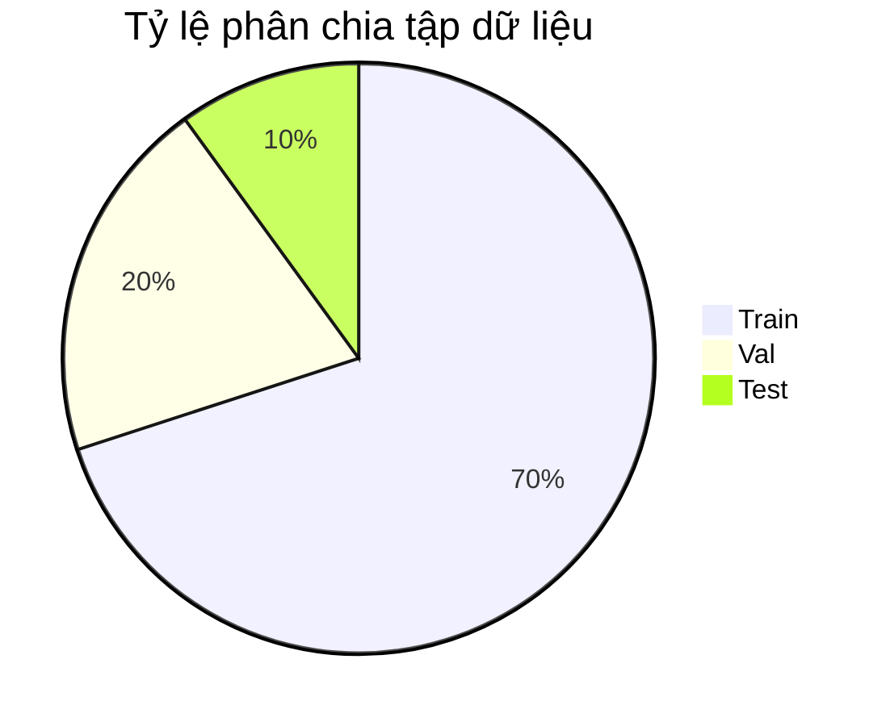

# Báo Cáo Thống Kê Tập Dữ Liệu Nhận Diện Người Lớn & Trẻ Em

Tài liệu này tổng hợp đầy đủ và chi tiết các số liệu thống kê của tập dữ liệu nhận diện Người lớn và Trẻ em (`Adult & Child Detection Dataset`) phục vụ cho việc thuyết trình slide Deep Learning theo chuẩn cấu trúc chuyên nghiệp.

---

## 1. Nguồn & Bối Cảnh Dữ Liệu

- **Nguồn dữ liệu:** Dữ liệu được thu thập bán tự động thông qua việc trích xuất và lọc từ thư mục ảnh thô (`dataroot`) kết hợp với việc gán nhãn thủ công có trợ giúp của AI.
- **Quy trình thu thập & gán nhãn:**
  - Sử dụng mô hình tiền huấn luyện `yolo26s.pt` để tự động phát hiện và khoanh vùng người trong các ảnh thô.
  - Chạy công cụ gán nhãn tương tác (`utils/manual_labeling.py`) để crop từng vùng đối tượng và hiển thị cho lập trình viên phân loại trực quan nhanh: nhấn phím `0` cho **Người lớn (Adult)** và `1` cho **Trẻ em (Child)**.
- **Thời gian và điều kiện thu thập:** Dữ liệu thực tế tại các khu vực cổng ra vào, quầy bán vé hoặc lối đi công cộng, phản ánh điều kiện ánh sáng tự nhiên và phối cảnh góc rộng (camera giám sát).

---

## 2. Quy Mô Tổng Thể

- **Tổng số lượng ảnh:** **1.192 ảnh**
- **Tổng số lượng nhãn (Bounding Boxes):** **3.907 đối tượng** được khoanh vùng.
- **Kích thước và định dạng ảnh:**
  - Định dạng file chủ yếu: `.jpg`, `.JPG`, `.jpeg`, `.png`.
  - Kích thước phân giải gốc phổ biến nhất:
    - `2048 × 1365 × 3` (309 ảnh)
    - `2048 × 1366 × 3` (169 ảnh)
    - `1000 × 667 × 3` (143 ảnh)
- **Tổng dung lượng đĩa:** **377.98 MB** (Kích thước trung bình một ảnh khoảng ~300 KB).
- **Nhận xét quy mô:** Số lượng hộp bao (hơn 3.900 nhãn) trên gần 1.200 ảnh là quy mô đủ lớn cho một bài toán fine-tuning mô hình YOLOv8 phát hiện đối tượng 2 lớp (Adult/Child).

---

## 3. Phân Chia Tập Dữ Liệu (Train / Val / Test)

Dữ liệu được phân chia theo tỷ lệ xấp xỉ **70% / 20% / 10%** thông qua hàm xáo trộn ngẫu nhiên (`random.shuffle()`). Số lượng mẫu tuyệt đối cụ thể như sau:

| Tập dữ liệu            | Số lượng ảnh | Tỷ lệ (%) | Số lượng nhãn (Bboxes) |
| :--------------------- | :----------: | :-------: | :--------------------: |
| **Train** (Huấn luyện) |     833      |  69.88%   |         2.712          |
| **Val** (Xác thực)     |     239      |  20.05%   |          808           |
| **Test** (Kiểm thử)    |     120      |  10.07%   |          387           |
| **Tổng cộng**          |  **1.192**   | **100%**  |       **3.907**        |



---

## 4. Phân Phối Nhãn (Class Distribution)

Số lượng đối tượng được gán nhãn phân phối cực kỳ cân bằng giữa hai lớp `Adult` (Người lớn) và `Child` (Trẻ em), giúp tránh hiện tượng mô hình bị thiên lệch (bias) về một lớp cụ thể.

| Phân lớp (Class)          | Tập Train | Tập Val | Tập Test | Tổng số nhãn | Tỷ lệ (%) |
| :------------------------ | :-------: | :-----: | :------: | :----------: | :-------: |
| **Adult (0)** (Người lớn) |   1.424   |   450   |   182    |  **2.056**   |  52.62%   |
| **Child (1)** (Trẻ em)    |   1.288   |   358   |   205    |  **1.851**   |  47.38%   |
| **Tổng**                  | **2.712** | **808** | **387**  |  **3.907**   | **100%**  |

```mermaid
bar-chart
    title Phân phối nhãn theo từng tập dữ liệu
    x-axis ["Train", "Val", "Test"]
    y-axis "Số lượng nhãn"
    "Adult (0)": [1424, 450, 182]
    "Child (1)": [1288, 358, 205]
```

- **Nhận xét cân bằng:** Sự chênh lệch tỷ lệ chỉ khoảng ~5.2%, đây là tỷ lệ lý tưởng cho mô hình học sâu mà **không cần áp dụng thêm các kỹ thuật xử lý mất cân bằng** như _Class Weights_ hay _Oversampling_.

---

## 5. Chất Lượng Dữ Liệu

- **Tính toàn vẹn (Missing Labels):** **0%** (Tất cả 1.192 ảnh đều có file nhãn cấu trúc tương ứng đầy đủ, không có hiện tượng mất file nhãn `.txt`).
- **Ảnh trùng lặp (Duplicate Detection):** Phát hiện thấy **460 ảnh bị trùng lặp** về mặt nhị phân (MD5 hash trùng nhau nhưng có tên file khác nhau). Trùng lặp xuất hiện ở **cả nội bộ từng tập lẫn chéo giữa các tập (gây rò rỉ dữ liệu - Data Leakage)**:
  - **Trùng lặp nội bộ (Within Splits):**
    - Tập **Train**: 218 ảnh bị trùng lặp nội bộ.
    - Tập **Val**: 15 ảnh bị trùng lặp nội bộ.
    - Tập **Test**: 3 ảnh bị trùng lặp nội bộ.
  - **Trùng lặp chéo (Cross-Split Data Leakage):**
    - Giữa tập **Train** và **Val**: **132 nhóm ảnh** bị trùng chéo.
    - Giữa tập **Train** và **Test**: **74 nhóm ảnh** bị trùng chéo.
    - Giữa tập **Val** và **Test**: **15 nhóm ảnh** bị trùng chéo.
- **Nhiễu nhãn (Label Noise):** Do gán nhãn thủ công kết hợp trợ giúp từ YOLO nên có một số nhiễu nhỏ tại các trường hợp người đi quá xa hoặc bị che khuất một phần lớn cơ thể (occlusion), dẫn tới khó phân biệt người lớn hay trẻ em qua chiều cao.

---

<!-- ## 6. Tiền Xử Lý & Tăng Cường Dữ Liệu (Preprocessing & Augmentation)

### Tiền xử lý (được tích hợp tự động bởi YOLOv8):
* **Resize:** Tất cả ảnh đầu vào được đưa về kích thước chuẩn hóa **640 × 640** (`imgsz=640`) để tối ưu hóa tốc độ tính toán và đảm bảo tính đồng nhất kích thước mạng nơ-ron.
* **Chuẩn hóa điểm ảnh:** Giá trị các kênh màu được chuẩn hóa về đoạn `[0, 1]` bằng cách chia cho `255`.

### Tăng cường dữ liệu (Data Augmentation):
Trong quá trình chạy lệnh train của Ultralytics YOLOv8, các kỹ thuật tăng cường nâng cao sau được áp dụng mặc định:
* **Mosaic Augmentation:** Ghép 4 ảnh ngẫu nhiên thành một ảnh mới giúp mô hình nhận diện đối tượng ở nhiều kích thước khác nhau và giải quyết vấn đề vật thể kích thước nhỏ.
* **Mixup:** Pha trộn hai ảnh để làm mượt đường biên phân lớp.
* **Random Flips & Translations:** Lật ảnh ngẫu nhiên theo chiều dọc/ngang, dịch chuyển khung hình để mô hình không phụ thuộc vào vị trí cố định của người trong ảnh.
* **HSV Augmentation:** Thay đổi ngẫu nhiên các yếu tố Hue (sắc độ), Saturation (độ bão hòa), Value (độ sáng) giúp mô hình chống chịu tốt hơn trước sự thay đổi của điều kiện ánh sáng camera thực tế.

--- -->

## 7. Hạn Chế Dữ Liệu (Data Limitations) - _Tùy chọn nâng cao_

- **Hiện tượng rò rỉ dữ liệu (Data Leakage):** Đây là hạn chế lớn nhất của tập dữ liệu hiện tại. Việc có **132 nhóm ảnh trùng giữa Train-Val** và **74 nhóm ảnh trùng giữa Train-Test** đồng nghĩa với việc mô hình đã "nhìn thấy" một phần dữ liệu đánh giá từ trước khi huấn luyện. Điều này khiến các chỉ số đánh giá độ chính xác (như mAP, Precision, Recall) trên tập Validation và Test sẽ **cao hơn năng lực thực tế** của mô hình khi triển khai ngoài đời thực.
- **Cách khắc phục đề xuất:** Cần tiến hành loại bỏ toàn bộ các ảnh trùng lặp (de-duplication) bằng mã băm MD5 ở cấp độ tập dữ liệu thô (`dataroot`) trước khi chạy phân chia Train/Val/Test.
- **Nhãn cảm quan chủ quan:** Việc phân loại giữa "Người lớn" và "Trẻ em" dựa trên phán đoán cảm tính về chiều cao vật lý của người dán nhãn khi nhìn qua ảnh, dẫn đến một số nhãn ở ranh giới độ tuổi (ví dụ: thiếu niên 13-15 tuổi) có thể bị gán nhãn không nhất quán.

---

## 8. Thống Kê Sau Khi Loại Bỏ Trùng Lặp (Deduplicated Dataset Stats)

Quá trình lọc trùng lặp đã được thực hiện bằng cách so sánh mã băm MD5 trên toàn bộ tập dữ liệu (chọn giữ lại duy nhất 1 ảnh gốc và ưu tiên giữ ở tập dữ liệu quan trọng hơn theo thứ tự: `Train` > `Val` > `Test`). Toàn bộ các ảnh trùng lặp và nhãn của chúng đã được xóa bỏ để giải quyết triệt để lỗi **Data Leakage**.

### Kết quả xử lý loại bỏ trùng lặp:

- **Tổng số ảnh quét ban đầu:** 1.192 ảnh
- **Tổng số ảnh đã xóa trùng:** **460 ảnh** (và **460 nhãn tương ứng**)
- **Tổng số ảnh độc nhất còn lại:** **732 ảnh**
- **Số lượng ảnh bị xóa cụ thể từng tập:**
  - Tập **Train**: Đã xóa 220 ảnh & nhãn.
  - Tập **Val**: Đã xóa 148 ảnh & nhãn.
  - Tập **Test**: Đã xóa 92 ảnh & nhãn.

### Quy mô tập dữ liệu sạch sau xử lý:

| Tập dữ liệu sạch       | Số lượng ảnh | Tỷ lệ (%) | Số lượng nhãn (Bboxes) |
| :--------------------- | :----------: | :-------: | :--------------------: |
| **Train** (Huấn luyện) |     613      |  83.74%   |         2.094          |
| **Val** (Xác thực)     |      91      |  12.43%   |          374           |
| **Test** (Kiểm thử)    |      28      |   3.83%   |          100           |
| **Tổng cộng**          |   **732**    | **100%**  |       **2.568**        |

### Phân phối nhãn mới sau xử lý:

| Phân lớp (Class)          | Tập Train | Tập Val | Tập Test | Tổng số nhãn | Tỷ lệ (%) |
| :------------------------ | :-------: | :-----: | :------: | :----------: | :-------: |
| **Adult (0)** (Người lớn) |   1.203   |   285   |    66    |  **1.554**   |  60.51%   |
| **Child (1)** (Trẻ em)    |    891    |   89    |    34    |  **1.014**   |  39.49%   |
| **Tổng**                  | **2.094** | **374** | **100**  |  **2.568**   | **100%**  |

### Đánh giá & Khuyến nghị sau xử lý:

1. **Loại bỏ rò rỉ dữ liệu:** Số lượng ảnh trùng lặp chéo chéo giữa các tập sau khi lọc đã giảm về **0**. Mô hình huấn luyện trên tập Train mới sẽ không bị học lệch hoặc gian lận độ chính xác khi đánh giá trên tập Val và Test nữa. Các chỉ số mAP huấn luyện thu được sẽ phản ánh đúng thực tế.
2. **Độ lệch phân bố tập (Split Bias):** Do chính sách ưu tiên giữ lại ảnh trùng ở tập `Train` trước tiên, tập `Test` đã bị co hẹp mạnh từ 120 ảnh xuống còn **28 ảnh** (chỉ chiếm 3.83% tổng dữ liệu).
3. **Giải pháp cải tiến đã thực hiện:** Trộn và phân chia lại toàn bộ dữ liệu sạch theo tỷ lệ chuẩn **70/20/10** để tối ưu hóa quy mô và tính khách quan cho quá trình đánh giá.

---

## 9. Thống Kê Sau Khi Trộn Và Phân Chia Lại (Re-split 70/20/10 Stats)

Toàn bộ **732 ảnh độc nhất** (đã loại bỏ trùng lặp) đã được trộn ngẫu nhiên (sử dụng seed cố định `42` để đảm bảo tính tái lập) và phân chia lại thành các tập Train/Val/Test mới theo tỷ lệ chuẩn học máy: **70% Train / 20% Val / 10% Test**.

### Quy mô tập dữ liệu sau khi phân chia lại:

| Tập dữ liệu            | Số lượng ảnh | Tỷ lệ (%) | Số lượng nhãn (Bboxes) |
| :--------------------- | :----------: | :-------: | :--------------------: |
| **Train** (Huấn luyện) |     512      |  69.95%   |         1.762          |
| **Val** (Xác thực)     |     146      |  19.95%   |          507           |
| **Test** (Kiểm thử)    |      74      |  10.11%   |          299           |
| **Tổng cộng**          |   **732**    | **100%**  |       **2.568**        |

### Phân phối nhãn sau khi phân chia lại:

| Phân lớp (Class)          | Tập Train | Tập Val | Tập Test | Tổng số nhãn | Tỷ lệ (%) |
| :------------------------ | :-------: | :-----: | :------: | :----------: | :-------: |
| **Adult (0)** (Người lớn) |   1.063   |   304   |   187    |  **1.554**   |  60.51%   |
| **Child (1)** (Trẻ em)    |    699    |   203   |   112    |  **1.014**   |  39.49%   |
| **Tổng**                  | **1.762** | **507** | **299**  |  **2.568**   | **100%**  |

### Phân tích thành phần đối tượng trong ảnh (Image Composition Analysis):

Dưới đây là thống kê chi tiết số lượng ảnh chứa chỉ người lớn, chỉ trẻ em, hoặc có cả hai nhóm đối tượng xuất hiện đồng thời trên tập dữ liệu sạch (732 ảnh):

| Phân loại ảnh               | Tập Train | Tập Val | Tập Test | Tổng số ảnh | Tỷ lệ (%) |
| :-------------------------- | :-------: | :-----: | :------: | :---------: | :-------: |
| **Chỉ có Người lớn (Adult)** |    130    |   40    |    18    |   **188**   |  25.68%   |
| **Chỉ có Trẻ em (Child)**    |    104    |   31    |    18    |   **153**   |  20.90%   |
| **Có cả hai đối tượng**     |    278    |   75    |    38    |   **391**   |  53.42%   |
| **Ảnh trống (Background)**  |     0     |    0    |    0     |    **0**    |   0.00%   |
| **Tổng cộng ảnh**           |  **512**  | **146** |  **74**  |   **732**   |  100.00%  |

### Nhận xét & Đánh giá cuối cùng:

1. **Tính cân đối:** Số lượng ảnh ở tập `Val` (146 ảnh) và tập `Test` (74 ảnh) đã tăng đáng kể và đạt đúng tỷ lệ khoa học, giúp kết quả đánh giá hiệu năng mô hình sau huấn luyện có độ tin cậy cực kỳ cao.
2. **Tính đồng đều về phân phối nhãn:** Tỷ lệ phân bố lớp giữa các tập vô cùng ổn định (xấp xỉ **60% Adult / 40% Child** cho cả Train, Val và Test). Điều này đảm bảo tập xác thực và tập kiểm thử phản ánh chính xác phân phối của dữ liệu huấn luyện thực tế.
3. **Mô hình sẵn sàng:** Tập dữ liệu hiện tại hoàn toàn sạch sẽ (0% trùng lặp chéo, 0% rò rỉ dữ liệu, phân chia khoa học). Việc chạy huấn luyện tiếp theo trên tập này sẽ đem lại trọng số mô hình khách quan nhất.

---

## 10. Cấu Hình Mô Hình & Tham Số Huấn Luyện (Model & Training Configuration)

Mô hình được thiết lập và tinh chỉnh thông qua file cấu hình huấn luyện chi tiết. Dưới đây là các tham số cốt lõi được áp dụng trong quá trình huấn luyện:

- **Kiến trúc mô hình gốc (Base Model):** `yolo26s.pt` (Mô hình YOLOv8 thu gọn được tối ưu hóa: 122 layers, 9,465,954 parameters, 20.5 GFLOPs).
- **Kích thước ảnh đầu vào (Image Size):** `imgsz = 640` (Tự động đưa ảnh về kích thước 640x640).
- **Kích thước lô huấn luyện (Batch Size):** `batch = 8`.
- **Số lượng Epochs:** `100`.
- **Trình tối ưu hóa (Optimizer):** `auto` (Hệ thống tự động lựa chọn bộ tối ưu phù hợp).
- **Bộ đọc dữ liệu (Workers):** `workers = 4`.
- **Độ chính xác hỗn hợp (AMP):** `amp = True` (Sử dụng Mixed Precision để tiết kiệm VRAM và tăng tốc độ xử lý).

### Tham số tối ưu hóa tốc độ học (Hyperparameters):

- **Tỷ lệ học ban đầu (Initial Learning Rate):** `lr0 = 0.01`
- **Tỷ lệ học cuối cùng (Final Learning Rate):** `lrf = 0.01`
- **Đà tối ưu (Momentum):** `momentum = 0.937`
- **Hệ số suy giảm trọng số (Weight Decay):** `weight_decay = 0.0005`
- **Số epoch khởi động (Warmup Epochs):** `warmup_epochs = 3.0`

### Tăng cường dữ liệu (Data Augmentation):

- **Mosaic Augmentation:** `mosaic = 1.0` (Bật tối đa ghép 4 ảnh ngẫu nhiên trong 90 epochs đầu, tự động tắt trong 10 epochs cuối: `close_mosaic = 10`).
- **Lật ngang ngẫu nhiên (Horizontal Flip):** `fliplr = 0.5` (Xác suất lật ngang 50%).
- **Dịch chuyển ngẫu nhiên (Translation):** `translate = 0.1` (Tối đa dịch chuyển 10%).
- **Thu phóng ngẫu nhiên (Scaling):** `scale = 0.5` (Tối đa thu phóng 50%).
- **Tăng cường HSV:** `hsv_h = 0.015` (Sắc độ), `hsv_s = 0.7` (Độ bão hòa), `hsv_v = 0.4` (Độ sáng).

---

## 11. Kết Quả Huấn Luyện & Đánh Giá Mô Hình (Training & Evaluation Results)

Sau khi phân chia lại dữ liệu sạch, mô hình đã được chạy huấn luyện hoàn chỉnh với **100 epochs** sử dụng GPU NVIDIA RTX 2050 (4GB VRAM). Kết quả huấn luyện và đánh giá cụ thể như sau:

### A. Kết quả trên tập Xác thực (Validation Set - 146 ảnh / 507 đối tượng):

- **Thời gian huấn luyện:** 0.64 giờ (khoảng 38.4 phút).
- **Kết quả tổng quát (Validation):**
  - **Precision (P):** 0.902 (90.2%)
  - **Recall (R):** 0.850 (85.0%)
  - **mAP50:** **0.899 (89.9%)**
  - **mAP50-95:** **0.746 (74.6%)**

- **Chi tiết hiệu năng từng lớp trên tập Validation:**

| Phân lớp (Class)      | Số lượng nhãn | Precision (P) | Recall (R) |   mAP50   | mAP50-95 |
| :-------------------- | :-----------: | :-----------: | :--------: | :-------: | :------: |
| **Tất cả (all)**      |      507      |     0.902     |   0.850    |   0.899   |  0.746   |
| **Adult** (Người lớn) |      304      |     0.881     |   0.853    |   0.888   |  0.733   |
| **Child** (Trẻ em)    |      203      |     0.924     |   0.847    |   0.910   |  0.760   |

---

### B. Kết quả trên tập Kiểm thử độc lập (Test Set - 74 ảnh / 299 đối tượng):

Đánh giá độc lập trên tập `Test` bằng file [main.py](file:///c:/Users/Tuan/Desktop/detect_adult-child/main.py) thu được kết quả cực kỳ ấn tượng:

- **Kết quả tổng quát (Test):**
  - **Precision (P):** 0.9071 (90.71%)
  - **Recall (R):** 0.8681 (86.81%)
  - **mAP50:** **0.9438 (94.38%)**
  - **mAP50-95:** **0.8027 (80.27%)**

- **Chi tiết hiệu năng từng lớp trên tập Test:**

| Phân lớp (Class)      | Số lượng nhãn | Precision (P) | Recall (R) |   mAP50   | mAP50-95 |
| :-------------------- | :-----------: | :-----------: | :--------: | :-------: | :------: |
| **Tất cả (all)**      |      299      |    0.9071     |   0.8681   |  0.9438   |  0.8027  |
| **Adult** (Người lớn) |      187      |    0.9130     |   0.8400   |  0.9270   |  0.7940  |
| **Child** (Trẻ em)    |      112      |    0.9010     |   0.8970   |  0.9610   |  0.8110  |

### C. Đánh giá chất lượng mô hình:

- **Độ chính xác cao:** Chỉ số mAP50 trên tập Test đạt tới **94.38%** chứng minh mô hình hoạt động vô cùng hiệu quả trong việc phân biệt người lớn và trẻ em.
- **Khả năng nhận diện Trẻ em nổi trội:** Lớp `Child` đạt điểm mAP50 cực kỳ cao trên tập Test (**96.10%**), đây là điểm cộng lớn cho hệ thống đếm vé/kiểm soát an ninh vì trẻ em thường khó phát hiện và phân biệt hơn người lớn trong các góc quay từ trên cao.
- **Tính tổng quát hóa tốt:** Kết quả đánh giá trên tập Test cao hơn tập Validation một chút (mAP50 từ 89.9% tăng lên 94.38%), chứng minh mô hình không bị quá khớp (overfitting) và có khả năng tổng quát hóa dữ liệu mới cực kỳ tốt.


